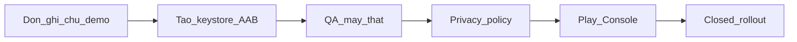
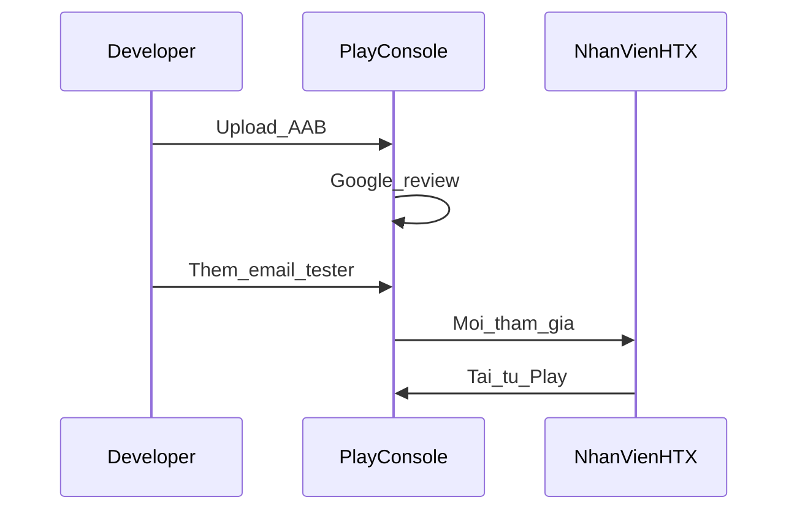

# Kế hoạch triển khai Play Store (Closed Testing)

> **Ngoài phạm vi:** build APK release và gửi tester cài tay — bạn nhờ agent khác xử lý.

## Bối cảnh

| Thành phần | Trạng thái hiện tại |
|------------|---------------------|
| Backend | Đã deploy — `https://tiennuoc.web.app` |
| App Flutter | [`app android/`](file:///Users/duongdao/Dự%20án%20nhà%20máy%20nước/app%20android) — `vn.company.tiennuoc`, v1.0.0+1 |
| targetSdk / minSdk | 35 / 24 — đạt yêu cầu Play |
| Keystore release | **Chưa có** — cần tạo trước khi upload |
| Privacy policy | **Chưa có** trang web |
| Phân phối | **Closed testing** — chỉ email nhân viên HTX |
| Tài khoản | Bạn đã đổi password + phân quyền — giữ nguyên |



---

## Giai đoạn 0 — Điều kiện tiên quyết

- **Tài khoản Google Play Developer** ($25) — [play.google.com/console](https://play.google.com/console)
- **Danh sách email tester** (Gmail/Google Workspace của nhân viên thu)
- **Máy Android thật** có máy in nhiệt Bluetooth (nếu dùng in BT) — test release build sau ProGuard

---

## Giai đoạn 1 — Dọn ghi chú tài khoản demo trong tài liệu (~1 giờ)

Mục tiêu: không lộ credential cũ trong README/docs; **giữ nguyên** hệ thống tài khoản, password và phân quyền đã cấu hình.

**Không làm:** đổi mật khẩu, sửa API auth, sửa `prisma/seed.ts` (chỉ dùng local dev).

| File | Nội dung cần xử lý |
|------|-------------------|
| [`app android/README.md`](file:///Users/duongdao/Dự%20án%20nhà%20máy%20nước/app%20android/README.md) | Mục “Test với tài khoản demo”; checklist `admin/123456` |
| [`README.md`](file:///Users/duongdao/Dự%20án%20nhà%20máy%20nước/water-ocr-billing-firebase/README.md) | Bảng tài khoản demo; lệnh `provision-auth --password 123456` |
| [`docs/HANDOFF.md`](file:///Users/duongdao/Dự%20án%20nhà%20máy%20nước/water-ocr-billing-firebase/docs/HANDOFF.md) | Bảng `admin`/`123456`, hộ mock `0931000*` |
| [`docs/ANDROID_BACKEND_API.md`](file:///Users/duongdao/Dự%20án%20nhà%20máy%20nước/water-ocr-billing-firebase/docs/ANDROID_BACKEND_API.md) | Bảng credential demo; JSON `"password": "123456"` |
| [`docs/FLUTTER_ANDROID_AGENT_BRIEF.md`](file:///Users/duongdao/Dự%20án%20nhà%20máy%20nước/water-ocr-billing-firebase/docs/FLUTTER_ANDROID_AGENT_BRIEF.md) | Bảng demo; checklist `admin/123456` |
| [`docs/FIREBASE_TIENNUOC.md`](file:///Users/duongdao/Dự%20án%20nhà%20máy%20nước/water-ocr-billing-firebase/docs/FIREBASE_TIENNUOC.md) | Link HANDOFF “tài khoản demo” |

**Thay thế bằng:** “Tài khoản do quản trị HTX cấp”; placeholder `"password": "<mật-khẩu>"` trong ví dụ API.

---

## Giai đoạn 2 — Ký release & build AAB (0.5 ngày)

Cấu hình sẵn trong [`android/app/build.gradle`](file:///Users/duongdao/Dự%20án%20nhà%20máy%20nước/app%20android/android/app/build.gradle): R8 + shrink resources.

```bash
cd "app android/android/app"
keytool -genkey -v -keystore tiennuoc-release.jks \
  -keyalg RSA -keysize 2048 -validity 10000 -alias tiennuoc
cp ../key.properties.example ../key.properties
# Điền storeFile, mật khẩu

cd ../..
# Bump pubspec.yaml: version: 1.0.0+2 (mỗi lần upload +1)

flutter pub get
flutter build appbundle --release \
  --dart-define=API_BASE_URL=https://tiennuoc.web.app
```

**Output:** `build/app/outputs/bundle/release/app-release.aab`

- `key.properties` và `*.jks` — **không commit**
- Bật **Play App Signing** khi tạo app trên Console
- ProGuard rules in BT: [`proguard-rules.pro`](file:///Users/duongdao/Dự%20án%20nhà%20máy%20nước/app%20android/android/app/proguard-rules.pro)

---

## Giai đoạn 3 — QA trên máy thật (1 ngày)

| # | Kịch bản | Vai trò |
|---|----------|---------|
| 1 | Đăng nhập tài khoản nhân viên | Collector |
| 2 | Bảng thu load theo kỳ/tuyến | Collector |
| 3 | Tìm kiếm không dấu, không thứ tự | Collector |
| 4 | Chốt CSM → tiền đúng | Collector |
| 5 | Xác nhận thu → khớp web | Collector |
| 6 | In PDF | Collector |
| 7 | In nhiệt BT (release build) | Collector |
| 8 | Admin sửa CSM hộ đã thu | Admin |
| 9 | Token persist | Cả hai |
| 10 | Mất mạng — không crash | Collector |
| 11 | Nút back / menu admin | Admin |

**Go/no-go:** ≥10/11 Pass trước khi upload Play.

---

## Giai đoạn 4 — Privacy Policy trên web (0.5 ngày)

Play Store **bắt buộc URL** — tạo `https://tiennuoc.web.app/privacy`

**Nội dung tối thiểu (tiếng Việt):**
- App nhân viên nội bộ HTX / nhà máy nước
- Dữ liệu: SĐT đăng nhập, thông tin hộ, hóa đơn, chỉ số
- Bluetooth: in nhiệt; `neverForLocation` trên Android 12+
- Vị trí (Android 6–11): chỉ khi quét BT theo OS
- Lưu trữ: `tiennuoc.web.app` + secure storage trên thiết bị
- Xóa tài khoản: liên hệ quản trị HTX

**File:** `app/privacy/page.tsx` → deploy `npm run firebase:deploy-apphosting`

---

## Giai đoạn 5 — Cấu hình Play Console (1 ngày)

#### Tạo app

- **App name:** Thu tiền nước
- **Language:** Tiếng Việt | **Category:** Business / Productivity | **Free**

#### Store listing

| Mục | Gợi ý |
|-----|-------|
| Short description | App thu ghi số nước và xác nhận thanh toán cho nhân viên đi tuyến |
| Full description | Đăng nhập → bảng thu → CSM → thu tiền → in biên nhận. Đồng bộ tiennuoc.web.app |
| Icon | 512×512 | Feature graphic | 1024×500 |
| Screenshots | Đăng nhập, bảng thu, chi tiết hộ |
| Privacy policy URL | `https://tiennuoc.web.app/privacy` |

#### Data safety

| Loại | Thu thập | Chia sẻ | Mục đích |
|------|----------|---------|----------|
| Tên, SĐT nhân viên | Có | Không | Đăng nhập |
| Hộ / hóa đơn | Có | Không | Thu tiền nước |
| Bluetooth | Có | Không | In nhiệt |
| Vị trí (Android cũ) | Có | Không | Quét BT |

#### Bluetooth declaration

- In hóa đơn ESC/POS; không định vị người dùng

#### Upload Closed testing

1. **Testing → Closed testing** → track `alpha-htx`
2. Upload `app-release.aab`
3. Thêm email tester
4. Release notes + **Start rollout** (review 1–7 ngày)



---

## Giai đoạn 6 — Vận hành sau rollout

- Thu feedback 1–2 tuần
- Sửa lỗi → `versionCode++` → build AAB → upload track
- Khuyến nghị sau: Firebase Crashlytics, siết tìm kiếm nếu cần

---

## Timeline

| Giai đoạn | Thời gian |
|-----------|-----------|
| 1 — Dọn docs | ~1 giờ |
| 2 — Keystore + AAB | 0.5 ngày |
| 3 — QA | 1 ngày |
| 4 — Privacy + deploy | 0.5 ngày |
| 5 — Play Console | 1 ngày |
| 6 — Google review | 1–7 ngày |
| **Tổng** | **~5–10 ngày** |

---

## Phân công

| Việc | Ai làm |
|------|--------|
| Tạo tài khoản Play Developer, email tester | Bạn |
| Tạo keystore, backup `.jks` | Bạn |
| Gỡ ghi chú demo trong docs | Tôi |
| Trang `/privacy` + deploy web | Tôi |
| Bump version + hướng dẫn build AAB | Tôi / Bạn |
| QA checklist trên máy thật | Bạn + nhân viên |
| Play Console (listing, Data safety, upload) | Bạn (tôi cung cấp nội dung) |
| **APK cho tester cài tay** | **Agent khác** |

---

## Rủi ro

1. **Chưa có keystore** — bắt buộc trước upload Play
2. **Review Google** — có thể hỏi quyền Location (Android cũ): chỉ phục vụ quét BT in nhiệt
3. **In nhiệt sau R8** — test release build trên máy in thật
4. **Privacy URL** — bắt buộc trước khi submit lần đầu
