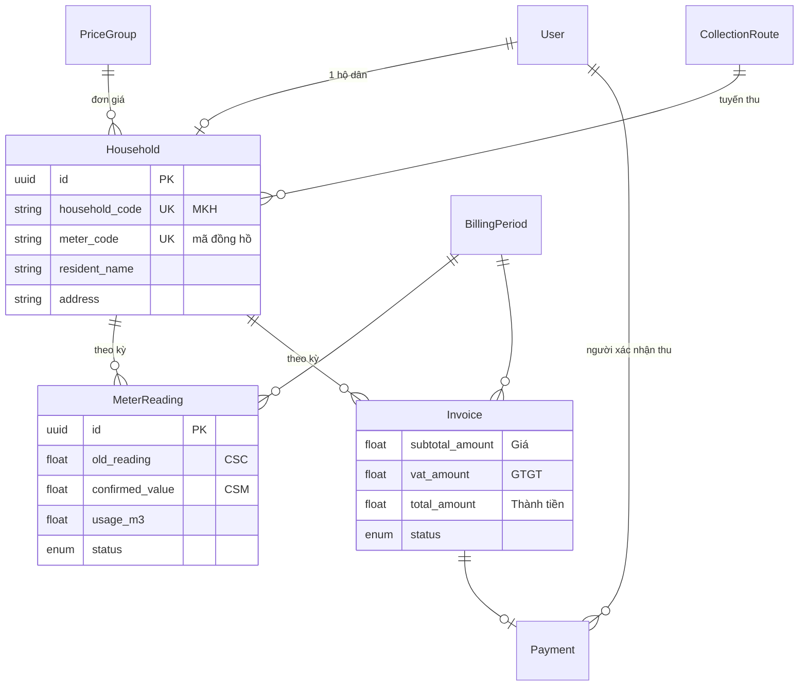

# Cấu trúc database & file Excel — HTX Tiên Lãng (tiennuoc)

Tài liệu này dùng để **đưa cho LLM** khi tổng hợp / chuyển đổi **dữ liệu thật từ file gốc** (Excel, sổ cũ) sang hệ thống thu tiền nước.

- **DB:** PostgreSQL `tiennuoc_water` (Cloud SQL)
- **ORM:** Prisma — nguồn sự thật: `prisma/schema.prisma`
- **Web:** https://tiennuoc.web.app

---

## 1. Mô hình nghiệp vụ (tóm tắt)



**Luồng dữ liệu chính**

1. Mỗi **hộ** (`household`) có **mã hộ MKH**, **mã đồng hồ**, **nhóm giá** (đ/m³), **tuyến thu**.
2. Mỗi **kỳ** = tháng/năm (`billing_period`, ví dụ T5/2026).
3. Mỗi hộ × kỳ: một **chỉ số** (`meter_reading`): **CSC** (`old_reading`) → **CSM** (`confirmed_value`) → **tiêu thụ** (`usage_m3` = CSM − CSC).
4. Sau khi chốt CSM: **hóa đơn** (`invoice`): Giá + GTGT = Thành tiền.
5. Đã thu: `invoice.status = PAID` + bản ghi `payment`.

**Quy tắc CSC:** CSC kỳ N thường = CSM kỳ N−1 đã chốt (chuỗi chỉ số).

**Tiền:** `subtotal_amount = round(usage_m3 × unit_price)`; `vat_amount = round(subtotal × vat_percent / 100)`; `total_amount = subtotal + vat_amount` (VAT mặc định 10%, lấy từ `system_settings`).

---

## 2. Bảng & cột (PostgreSQL)

### 2.1 `user` — Tài khoản đăng nhập

| Cột DB | Kiểu | Bắt buộc | Mô tả |
|--------|------|----------|--------|
| id | uuid | PK | |
| phone | text | UK | SĐT hoặc `admin` |
| firebase_uid | text | UK, null | Firebase Auth |
| password_hash | text | null | bcrypt (đăng nhập legacy) |
| name | text | | Họ tên |
| role | user_role | | `ADMIN` \| `RESIDENT` |
| created_at, updated_at | timestamptz | | |

### 2.2 `price_group` — Nhóm giá nước

| Cột DB | Kiểu | Mô tả |
|--------|------|--------|
| id | uuid | PK |
| code | text | UK, ví dụ `MAC_DINH` |
| name | text | Tên nhóm |
| unit_price | float | Đơn giá VNĐ/m³ |

### 2.3 `collection_route` — Tuyến thu

| Cột DB | Kiểu | Mô tả |
|--------|------|--------|
| id | uuid | PK |
| code | text | UK |
| name | text | Tên tuyến (tên sheet Excel thường theo tuyến) |
| sort_order | int | Thứ tự |
| unit_price | float | null — ghi đè giá tuyến (nếu có) |

### 2.4 `household` — Hộ dân (trục chính khi import)

| Cột DB | Kiểu | UK | Ánh xạ file gốc thường gặp |
|--------|------|-----|---------------------------|
| id | uuid | PK | (sinh mới) |
| household_code | text | UK | **MKH**, Mã hộ, Mã KH |
| meter_code | text | UK | **Mã ĐH**, mã đồng hồ |
| address | text | | Địa chỉ, Khu vực |
| resident_name | text | | Họ và tên |
| contact_phone | text | null | SĐT |
| status | household_status | | `ACTIVE` \| `INACTIVE` |
| payment_method | payment_method | | `CASH` \| `BANK_TRANSFER` |
| note | text | null | Ghi chú |
| collection_route_id | uuid | FK | Theo tên tuyến / sheet |
| route_sort_order | int | null | **STT** trên tuyến |
| user_id | uuid | FK, null | Liên kết tài khoản hộ dân |
| price_group_id | uuid | FK | Nhóm giá / đơn giá |

### 2.5 `billing_period` — Kỳ thu

| Cột DB | Kiểu | UK | Mô tả |
|--------|------|-----|--------|
| id | uuid | PK | |
| year | int | (year, month) | Năm |
| month | int | | Tháng 1–12 |
| status | period_status | | `OPEN` \| `CLOSED` |
| created_at | timestamptz | | |

### 2.6 `meter_reading` — Chỉ số đồng hồ (theo hộ × kỳ)

| Cột DB | Kiểu | UK | Ánh xạ Excel |
|--------|------|-----|--------------|
| id | uuid | PK | |
| household_id | uuid | (household_id, period_id) | qua MKH |
| period_id | uuid | | qua tháng/năm kỳ |
| old_reading | float | | **CSC** — chỉ số cũ |
| ocr_value | float | null | OCR (nếu có) |
| confirmed_value | float | null | **CSM** — chỉ số mới đã chốt |
| usage_m3 | float | null | **Tiêu thụ (m³)** = CSM − CSC |
| status | reading_status | | `PENDING` \| `CONFIRMED` \| `REJECTED` |
| input_method | input_method | null | `MANUAL`, `OCR_*` |
| image_path | text | null | Link ảnh |
| anomaly_flags | text | | JSON array string, mặc định `[]` |
| submitted_at | timestamptz | | |
| confirmed_at | timestamptz | null | Khi chốt |

**Ràng buộc:** Một hộ chỉ có **một** chỉ số mỗi kỳ.

### 2.7 `invoice` — Hóa đơn (theo hộ × kỳ)

| Cột DB | Kiểu | UK | Mô tả |
|--------|------|-----|--------|
| id | uuid | PK | |
| household_id | uuid | (household_id, period_id) | |
| period_id | uuid | | |
| usage_m3 | float | | Copy từ reading |
| unit_price | float | | Đ/m³ tại thời điểm chốt |
| subtotal_amount | float | | **Giá** (trước thuế) |
| vat_percent | float | | % GTGT |
| vat_amount | float | | **GTGT** |
| total_amount | float | | **Thành tiền** |
| pdf_path | text | null | |
| status | invoice_status | | `DRAFT` \| `ISSUED` \| `PAID` \| `CANCELLED` |
| issued_at | timestamptz | null | |
| zalo_sent_at, zalo_message_id | | null | Gửi Zalo |

### 2.8 `payment` — Đã thu tiền

| Cột DB | Kiểu | Mô tả |
|--------|------|--------|
| id | uuid | PK |
| invoice_id | uuid | UK — 1 hóa đơn 1 payment |
| amount | float | = `invoice.total_amount` |
| method | payment_method | `CASH` \| `BANK_TRANSFER` |
| note | text | null |
| confirmed_at | timestamptz | null |
| confirmed_by_id | uuid | FK user ADMIN |

### 2.9 Bảng phụ

| Bảng | Mục đích |
|------|----------|
| `system_settings` | `vat_percent` (mặc định 10), `period_close_day`, `timezone` |
| `notification` | Thông báo hộ dân |
| `audit_log` | Nhật ký thao tác |
| `invoice_send_log` | Lịch sử gửi HĐ |

---

## 3. Enum (giá trị hợp lệ)

```
user_role:          ADMIN | RESIDENT
reading_status:     PENDING | CONFIRMED | REJECTED
input_method:       OCR_CONFIRMED | OCR_EDITED | MANUAL
invoice_status:     DRAFT | ISSUED | PAID | CANCELLED
period_status:      OPEN | CLOSED
household_status:   ACTIVE | INACTIVE
payment_method:     CASH | BANK_TRANSFER
```

---

## 4. File Excel chuẩn hệ thống (import / export kỳ)

Đây là **định dạng file gốc mà web đã hỗ trợ** (`lib/xlsxImport.ts`, `lib/xlsxExport.ts`). LLM nên **chuẩn hóa file thật của bạn** về dạng này trước khi import.

### 4.1 Cấu trúc workbook

| Sheet | Mục đích |
|-------|----------|
| `HUONG DAN` | Hướng dẫn — **bỏ qua khi import** |
| `TONG HOP` | Tổng hợp tuyến — **bỏ qua khi import** |
| Mỗi **tuyến thu** | 1 sheet = 1 `collection_route` (tên sheet ≈ tên tuyến + có thể kèm `T5/2026`) |

### 4.2 Cột trên sheet tuyến (một kỳ)

| Cột Excel | Import đọc? | Ghi DB / tính toán |
|-----------|-------------|-------------------|
| STT | Không (chỉ hiển thị) | `household.route_sort_order` |
| Họ và tên | Không (đối chiếu) | `household.resident_name` |
| SĐT | Không | `household.contact_phone` |
| **MKH** | **Có — khóa** | `household.household_code` |
| Khu vực | Không | `household.address` / tuyến |
| Giá (đ/m³) | Không | `price_group` / `collection_route.unit_price` |
| CSC | Không khi import | `meter_reading.old_reading` (hệ thống tính chuỗi) |
| **CSM** | **Có** | `meter_reading.confirmed_value` → chốt `CONFIRMED` |
| Trạng thái duyệt | Không | |
| Link ảnh | Không | |
| Tiêu thụ (m³) | Không | Tính từ CSM − CSC |
| Tiền (VND) | Không | Tính từ usage × giá + VAT |
| **Đã thu (TT)** | **Có** | `Đã thu`, `da thu`, `x`, `yes`, `1` → `invoice` **PAID** + `payment` |
| **Hình thức TT** | **Có** | `Tiền mặt`/`TM`/`cash` → CASH; còn lại → BANK_TRANSFER |

**Cột tối thiểu để import một kỳ:** `MKH`, `CSM` (tuỳ chọn `Đã thu (TT)`, `Hình thức TT`).

### 4.3 Export tổng hợp (full) — tham chiếu cột

| Sheet | Cột chính |
|-------|-----------|
| Tong_quan | Chỉ tiêu thống kê |
| Ho_dan | Mã hộ, Mã đồng hồ, Tên, Địa chỉ, Nhóm giá, Đơn giá, SĐT |
| Ky_thu | Kỳ, Năm, Tháng, Trạng thái |
| Chi_so | Mã hộ, Kỳ, CSC, CSM, Tiêu thụ, Trạng thái, … |
| Hoa_don | Mã hộ, Kỳ, Tiền, Trạng thái HĐ, … |
| Thanh_toan | Mã hộ, Kỳ, Số tiền, Phương thức, … |

---

## 5. Hướng dẫn cho LLM: chuyển file gốc → dữ liệu import

### 5.1 Đầu vào cần có từ người dùng

1. **File gốc** (Excel/CSV) — kèm 5–10 dòng mẫu mỗi sheet.
2. **Kỳ áp dụng:** tháng + năm (vd. 5/2026).
3. Danh sách **tuyến** (nếu file không tách sheet).
4. **Đơn giá** theo nhóm/tuyến (nếu file có cột giá khác nhau).

### 5.2 Các bước tổng hợp đề xuất

1. **Danh mục hộ (master):** Trích unique `MKH` (+ mã đồng hồ, tên, địa chỉ, SĐT, tuyến). Map sang bảng `household` + `collection_route` + `price_group`.
2. **Kỳ:** Tạo hoặc tham chiếu `billing_period` (year, month).
3. **Chỉ số từng kỳ:** Với mỗi dòng có MKH + CSM:
   - `old_reading` = CSC (file) hoặc CSM kỳ trước nếu file không có CSC.
   - `confirmed_value` = CSM.
   - `usage_m3` = max(0, CSM − CSC).
   - `status` = `CONFIRMED` nếu có CSM hợp lệ.
4. **Hóa đơn:** Sau chốt: tính `subtotal_amount`, `vat_amount`, `total_amount`; `status` = `ISSUED` hoặc `PAID` nếu file đánh dấu đã thu.
5. **Thanh toán:** Nếu đã thu → `payment.amount` = `total_amount`, `method` theo cột hình thức TT.

### 5.3 Lỗi thường gặp cần tránh

- Trùng **MKH** hoặc trùng **mã đồng hồ** trong cùng danh mục.
- CSM < CSC.
- Import kỳ N khi kỳ N−1 chưa chốt (quy tắc nghiệp vụ web).
- Ghi `total_amount` không gồm VAT trong khi hệ thống dùng Giá + GTGT.

### 5.4 Đầu ra LLM nên tạo

**Phương án A — Excel chuẩn (khuyến nghị):** Workbook đúng mục 4 (mỗi tuyến 1 sheet, cột MKH/CSM/Đã thu/Hình thức TT) → upload trên web **Bảng thu nước → Import Excel**.

**Phương án B — JSON/SQL:** Mảng object theo thứ tự: `price_group` → `collection_route` → `household` → `billing_period` → `meter_reading` → `invoice` → `payment` (FK uuid tham chiếu lẫn nhau).

---

## 6. Prompt mẫu (copy cho LLM)

```text
Bạn là chuyên gia chuyển đổi dữ liệu thu tiền nước.

NGỮ CẢNH:
- Hệ thống đích: PostgreSQL schema "tiennuoc" (bảng household, billing_period, meter_reading, invoice, payment).
- Khóa nghiệp vụ: MKH = household_code; CSC/CSM = old_reading/confirmed_value; tiêu thụ = CSM - CSC.
- Tiền: subtotal = round(m3 * don_gia); vat = round(subtotal * 10%); total = subtotal + vat.

FILE GỐC ĐÍNH KÈM:
[Dán file hoặc mô tả sheet/cột]

KỲ CẦN NHẬP: Tháng __ / Năm __

YÊU CẦU:
1. Liệt kê mapping cột file gốc → cột hệ thống.
2. Xuất bảng hộ (MKH, mã ĐH, tên, địa chỉ, SĐT, tuyến, đơn giá).
3. Xuất chỉ số kỳ (MKH, CSC, CSM, m3, đã thu?, hình thức TT).
4. Cảnh báo dòng lỗi (CSM<CSC, MKH trùng, thiếu MKH).
5. (Tuỳ chọn) Tạo file Excel chuẩn import: mỗi tuyến 1 sheet, cột MKH, CSM, Đã thu (TT), Hình thức TT.

Tham chiếu schema chi tiết: [đính kèm toàn bộ file DATABASE_SCHEMA_FOR_LLM.md]
```

---

## 7. Tham chiếu mã nguồn

| File | Nội dung |
|------|----------|
| `prisma/schema.prisma` | Schema đầy đủ |
| `lib/xlsxImport.ts` | Logic import Excel kỳ |
| `lib/xlsxExport.ts` | Cột export Excel |
| `lib/billingSheet.ts` | Bảng thu, CSC chuỗi kỳ |
| `lib/vat.ts` | Công thức Giá + GTGT |
| `docs/QUY_TRINH_VAN_HANH.md` | Quy trình vận hành |

---

*Cập nhật theo codebase — dùng kèm file gốc thật của HTX khi gọi LLM.*
